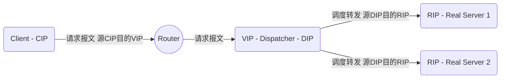
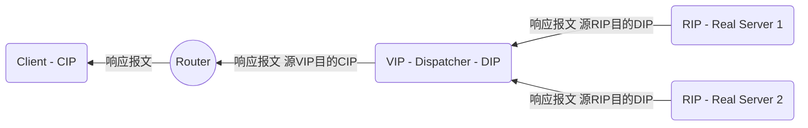
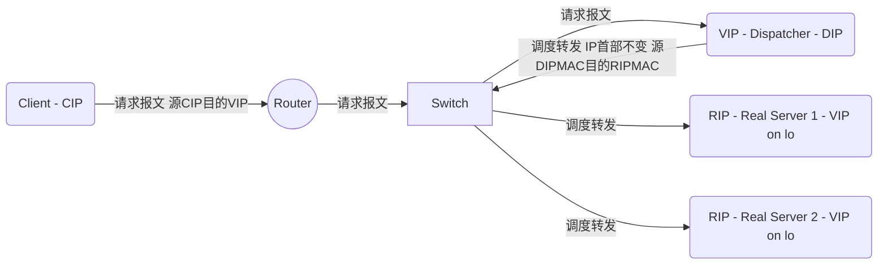
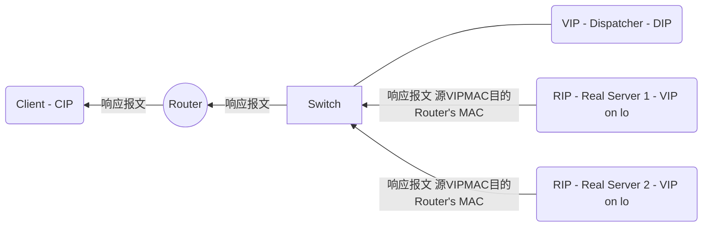
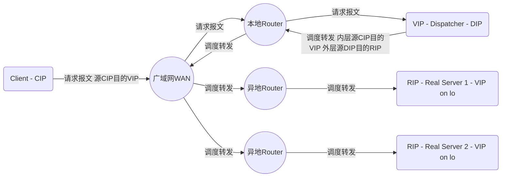
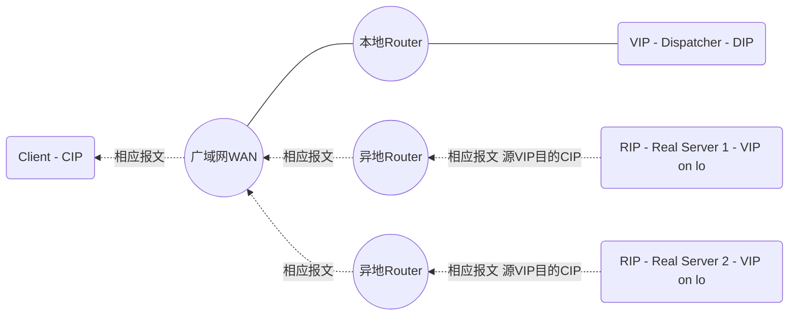
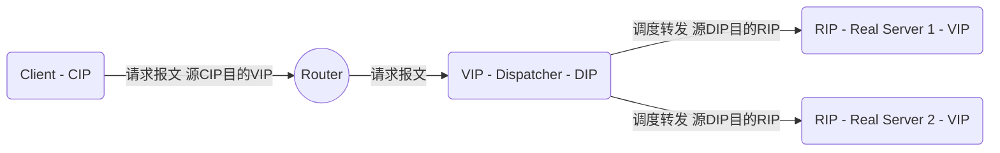

# LVS

LVS：Linux Virtual Server，是以“软件”、通过“四层”调度、实现“负载均衡”。

- **软件方式实现集群：** lvs软件是Linux内核中的一个框架，以模块方式加载。

- **四层调度：** lvs工作于通信子网（内核中），即可检测“请求报文”中各层“首部”获取“目标物理地址”、“目标逻辑地址”、“目标传输层协议类型及端口”。但对于“应用层”无能为力。

- **负载均衡：** lvs实现的是负载均衡集群，即将收到的“请求报文”使用“调度算法”计算，再发送至后端的RS服务器。

# 调度算法

一共10中，又根据是否考虑后端RS的“负载情况”，分为“静态方法”和“动态方法”。

- 静态算法：仅根据算法本身和请求报文特征进行调度，起点公平
- 动态算法：需要额外考虑后端各RS的当前的负载状态，结果公平

## 静态方法

- **rr** ：round-robin，轮替，轮询。

    调度器将RS列个表（数组），依次将收到的请求报文发送至RS。
    
    举个栗子吧：一个老师（lvs），12颗糖（请求报文），3个孩子（RS），每个孩子一个碗（数组元素）。老师怎发糖呢？RS1的碗发一颗，RS2的碗发一颗，RS3的碗发一颗。还有糖，继续按照上面的顺序发。

- **wrr** ：weighted rr，加权轮询。

    方法同rr，并根据RS的性能赋予不同的权重。依据权重，RS在列表（数组）中出现不同的次数。

    还是举个栗子：还是老师发糖，还是发到碗。但是有个孩子有3个碗，所以他就到了3颗糖。

- **SH** ：Source Hashing，源地址哈希。

    将源地址进行哈希运算后取模，以确定发送至哪个RS。实现了session sticky，将来自于同一个IP地址的请求始终发往第一次挑中的RS，从而实现会话绑定。

- **DH** ：Destination Hashing，目标地址哈希。

    将目标地址进行哈希运算后取模，以确定发送至哪个RS。将发往同一个目标地址的请求始终转发至第一次挑中的RS，典型使用场景是正向代理缓存场景中的负载均衡。

## 动态方法

- **LC** ：least connections，最少链接

    根据连接数计算负载。

        Overhead=activeconns*256+inactiveconns
    
    活动链接非活动连接的负载肯定不同。默认活动链接的负载是非活动连接的256倍。

- **WLC** ：Weighted LC，加权的最少链接
    
    同LC，并根据RS服务器性能赋予权重。

        Overhead=(activeconns*256+inactiveconns)/weight
    
    问题：虽然加权，但还是会出现负载一样的情况，导致调度时将请求发送至权重小的RS。例如：刚开启服务，连接数均为0，计算结果为0。

- **SED** ：Shortest Expection Delay，最短期望延迟

    为了克服WLC的缺点。不考虑非活动链接数，活动链接数+1。避免了连接数为0时，负载一样。

        Overhead=(activeconns+1)*256/weight

    新的bug：当各RS权重差距非常大时，请求报文会一直被调度至权重大的RS，因为计算得到的负载小。例如：2台RS权重比1:9，

        RS1的负载：(0+1)*256/1 = 1/256
        RS2的负载：(8+1)*256/9 = 1/256

    当RS2被分得8个请求后，2个RS的负载才一样，此前RS1一直处于空闲。

- **NQ** ：Never Queue，永不排队

    先每个RS分一个请求，再SED。改进的sed。
				
- **LBLC** ：Locality-Based LC，基于局部性的最少连接

    动态的DH算法，DH+LC

    此算法是根据请求报文的目标ip地址的负载均衡调度，将相同的目标ip地址的请求调度到同一个服务器。若该rs可用，将发送请求；若该服务器不可用，则用最少连接的原则选出一台可用服务器来进行匹配。

- **LBLCR** ：LBLC with Replication，带复制功能的LBLC

    此种算法是针对目标ip地址的负载均衡，该算法根据请求的目标地址ip找出该地址对应的服务组，按最少连接的原则从服务组中选出一台服务器。
    
    若服务器没有超载，则发送请求到该服务器；若该服务器超载或者不可用，则按照最小连接的原则从这个集群中选出一台服务器。
    
    将该服务器添加到服务组中，在将请求发送到该服务器，同时当该服务器组中有一段时间没有被修改，将最忙的服务器从组中剔除，以降低复制的程度。

## 调度算法生产环境选型

未完待续... ...


# lvs集群类型中的术语：

|LVS集群术语|说明|
|:-|:-|
|vs|Virtual Server、Director、Dispatcher、Balancer |
|rs|Real Server、upstream server、backend server |
|CIP|Client IP |
|VIP |Virtual serve IP |
|RIP |Real server IP |
|DIP |Director IP |
			
CIP <--> VIP == DIP <--> RIP 


# LVS集群的类型

工作拓扑、转发机制

**LVS集群的类型**

|LVS集群的类型|说明|
|:-|:-|
| lvs-nat |多目标DNAT。通过修改请求的目标IP和（或）Port为经由调度算法挑选出的某后端RS的RIP和PORT。|
| lvs-dr |封装新的MAC地址。通过在原IP报文外封装帧首部（源MAC、目标MAC），目标MAC是由调度算法挑选出的某后端RS的MAC地址。|
| lvs-tun |IP隧道。通过在源IP报文（CIP VIP）外再封装一个新IP首部（DIP RIP）完成调度。|
| lvs-fullnat |修改请求报文的源和目标IP。通过修改请求的源IP（CIP --> DIP）目标IP（VIP --> RIP）完成调度。|

## lvs-nat

多目标IP的DNAT，通过将请求报文中的目标地址和目标端口修改为某挑出的RS的RIP和PORT实现转发；

**特性**

1. RIP和DIP必须在同一个IP网络，且应该使用私网地址；RS的网关要指向DIP；
   
2. 请求报文和响应报文都必须经由Director转发；Director易于成为系统瓶颈；
3. 支持端口映射，可修改请求报文的目标PORT；
4. vs必须是Linux系统，rs可以是任意系统；





## lvs-dr

Direct Routing，直接路由；
				
通过为请求报文重新封装一个MAC首部进行转发，源MAC是DIP所在的接口的MAC，目标MAC是某挑选出的RS的RIP所在接口的MAC地址；源IP/PORT，以及目标IP/PORT均保持不变；
				
Director和各RS都得配置使用VIP；

**特性**

1. 确保前端路由器将目标IP为VIP的请求报文发往Director：
   - (a) 在前端网关做静态绑定；
   - (b) 在RS上使用arptables；
   - (c) 在RS上修改内核参数以限制arp通告及应答级别；

            arp_announce
            arp_ignore

1. RS的RIP可以使用私网地址，也可以是公网地址；RIP与DIP在同一IP网络；RIP的网关不能指向DIP，以确保响应报文不会经由Director；

2. RS跟Director要在同一个物理网络；

3. 请求报文要经由Director，但响应不能经由Director，而是由RS直接发往Client；

4. 不支持端口映射；






## lvs-tun

转发方式：不修改请求报文的IP首部（源IP为CIP，目标IP为VIP），而是在原IP报文之外再封装一个IP首部（源IP是DIP，目标IP是RIP），将报文发往挑选出的目标RS；RS直接响应给客户端（源IP是VIP，目标IP是CIP）；

**特性**

1) DIP, VIP, RIP都应该是公网地址；

2) RS的网关不能，也不可能指向DIP；
3) 请求报文要经由Director，但响应不能经由Director；
4) 不支持端口映射；
5) RS的OS得支持隧道功能；





问题：因在IP报文外面再封装IP头，会造成帧大于MTU，导致分片。

## lvs-fullnat
				
通过同时修改请求报文的源IP地址和目标IP地址进行转发；
```
CIP <--> DIP 
VIP <--> RIP 
```

**特性**

1) VIP是公网地址，RIP和DIP是私网地址，且通常不在同一IP网络；因此，RIP的网关一般不会指向DIP；
   
2) RS收到的请求报文源地址是DIP，因此，只能响应给DIP；但Director还要将其发往Client；
3) 请求和响应报文都经由Director；
4) 支持端口映射；

注意：此类型默认不支持；



```
graph RL

    C(Client - CIP)
    D(VIP - Dispatcher - DIP)
    RS1(RIP - Real Server 1 - VIP)
    RS2(RIP - Real Server 2 - VIP)
    R((Router))

    RS1 -- 响应报文 源RIP目的DIP --> D
    RS2 -- 响应报文 源RIP目的DIP --> D
    D -- 响应转发 源VIP目的CIP --> R
    R -- 响应转发 --> C
```

## 总结：

- lvs-nat, lvs-fullnat：请求和响应报文都经由Director；
  - lvs-nat：RIP的网关要指向DIP；
  - lvs-fullnat：RIP和DIP未必在同一IP网络，但要能通信；
- lvs-dr, lvs-tun：请求报文要经由Director，但响应报文由RS直接发往Client；
  - lvs-dr：通过封装新的MAC首部实现，通过MAC网络转发；
  - lvs-tun：通过在原IP报文之外封装新的IP首部实现转发，支持远距离通信；
